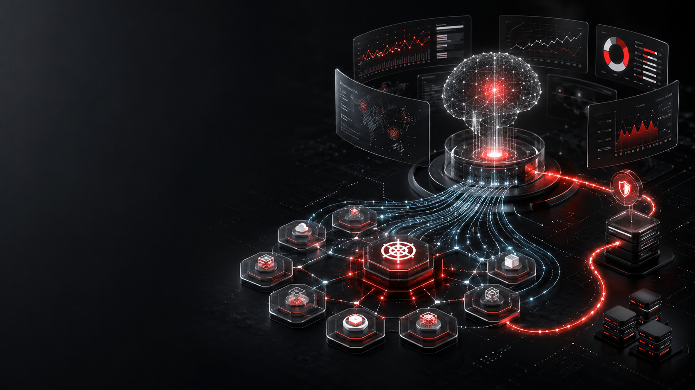
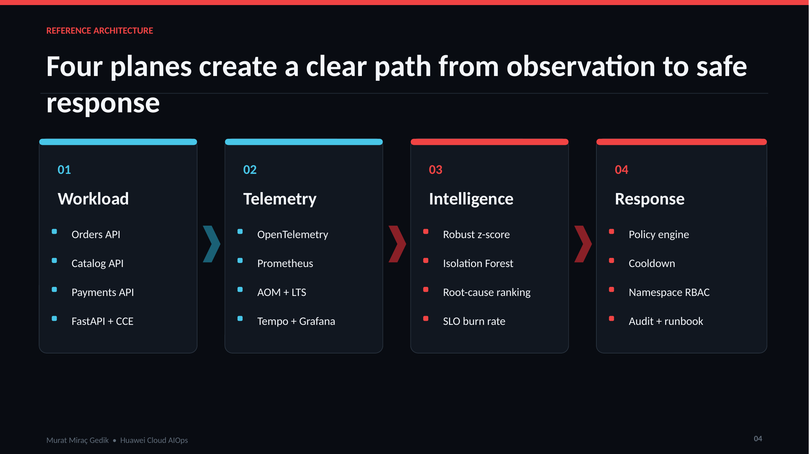
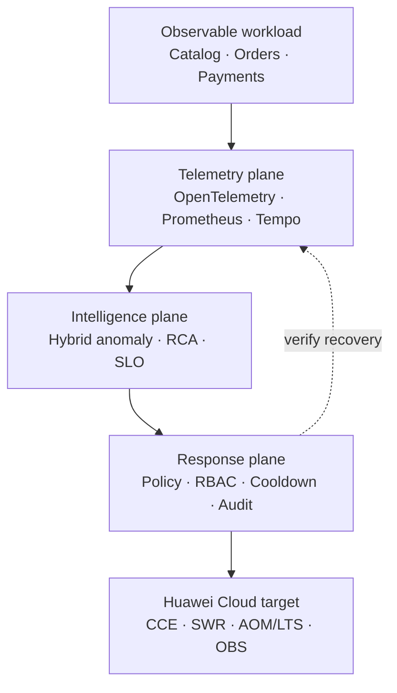
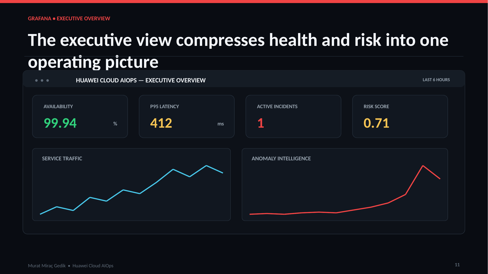
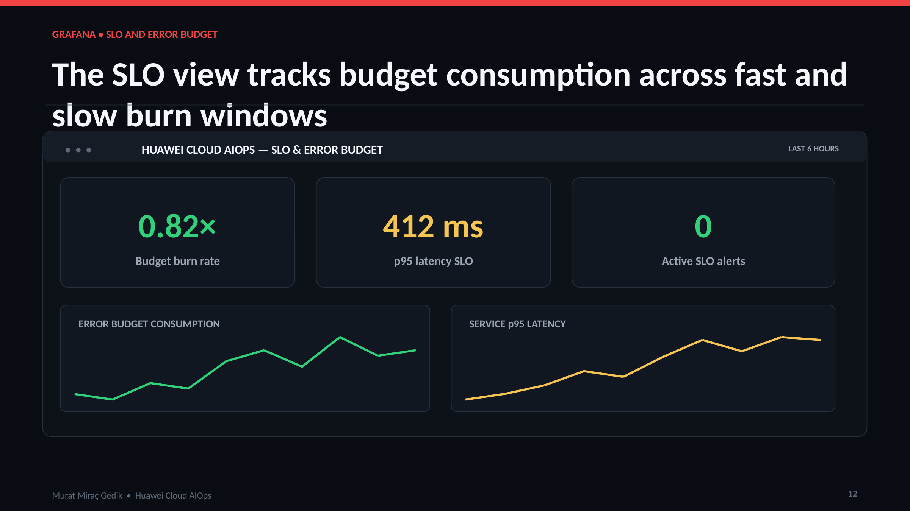
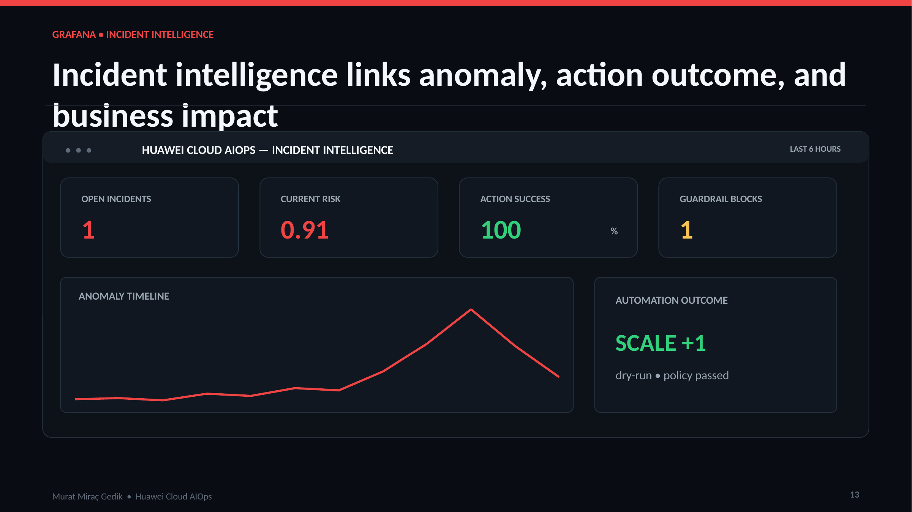

<div align="center">

# Huawei Cloud-Native AIOps, Observability & Automated Incident Response Platform

**An evidence-driven SRE reference architecture for detecting anomalies, ranking likely root causes and executing bounded, auditable incident responses on Huawei Cloud CCE.**

[](https://github.com/muratmiracg-dev/huawei-cloud-native-aIops-observability---automated-incident-response-platform/actions/workflows/ci.yml)
[](https://github.com/muratmiracg-dev/huawei-cloud-native-aIops-observability---automated-incident-response-platform/actions/workflows/security.yml)
[](LICENSE)
[](pyproject.toml)
[](docs/huawei-cloud-deployment.md)

</div>



## Project overview

This portfolio project implements a complete cloud-native operating model for
observability, AIOps and safe incident automation. Four observable FastAPI
services generate realistic operational signals; OpenTelemetry, Prometheus,
Tempo and Grafana connect metrics and traces; a hybrid anomaly engine combines
robust statistics with Isolation Forest; and a policy-controlled response
engine converts ranked evidence into reversible Kubernetes actions.

The platform is designed for Huawei Cloud Container Engine (CCE), Software
Repository for Container (SWR), Object Storage Service (OBS), Application
Operations Management (AOM), Log Tank Service (LTS) and Cloud Eye. The
application and telemetry interfaces remain portable, while Terraform and Helm
provide an explicit Huawei Cloud deployment path.

> [!IMPORTANT]
> This is a cloud-deployment-ready reference implementation, not a claim that
> infrastructure has been provisioned in a live Huawei Cloud account. A real
> deployment requires authorized credentials, region and cost decisions,
> network review, secret injection and an approved change window.

## Why this project exists

Traditional monitoring can show that a metric moved, but it does not prove what
caused the incident or whether an automated action is safe. This project closes
that gap through a six-stage evidence chain:

1. **Detect** — correlate metrics, logs and traces.
2. **Explain** — calculate a hybrid anomaly score and expose its components.
3. **Diagnose** — rank root-cause hypotheses from multiple signals.
4. **Constrain** — apply confidence, risk, RBAC, namespace and cooldown policies.
5. **Respond** — recommend or execute a bounded, reversible action.
6. **Verify** — measure SLO recovery and write an immutable audit record.

## Reference architecture





| Plane | Responsibilities | Main implementation |
|---|---|---|
| Workload | Generate business traffic, dependencies and controlled failure modes | FastAPI, HTTPX, idempotency, health probes |
| Telemetry | Collect vendor-neutral metrics and traces | OpenTelemetry, Prometheus, Tempo, Grafana |
| Intelligence | Detect departures, rank evidence and calculate reliability risk | Median/MAD, Isolation Forest, RCA rules, SLO burn rate |
| Response | Select and constrain safe operational actions | Policy engine, dry-run, cooldown, Kubernetes RBAC, audit |
| Cloud target | Provide managed compute, registry, storage and operations services | Huawei Cloud CCE, SWR, OBS, AOM/LTS, Cloud Eye |

## Core capabilities

### Observable microservice workload

- Catalog, Orders and Payments APIs plus a dedicated AIOps control-plane API.
- End-to-end order orchestration with inventory reservation, deterministic
  payment outcomes, retry behavior and idempotent order creation.
- `/health/live`, `/health/ready`, `/metrics` and correlated structured logs.
- Controlled latency and error injection for repeatable incident simulations.
- Non-root, read-only containers with explicit health checks.

### Explainable AIOps

The anomaly score intentionally combines an interpretable statistical signal
with an unsupervised pattern detector:

$$
\text{combined score} =
0.65 \times \text{robust deviation} +
0.35 \times \text{Isolation Forest}
$$

- Median and median absolute deviation resist outliers and make the statistical
  evidence human-readable.
- Isolation Forest evaluates both signal value and rate of change.
- Deterministic random state makes demonstrations and tests reproducible.
- Ranked root-cause hypotheses require correlated evidence; a single alert is
  not treated as causation.
- Warning and critical decisions are separated by explicit thresholds.

See [AIOps methodology](docs/aiops-methodology.md) and
[ADR-001](docs/adr/ADR-001-hybrid-anomaly-detection.md).

### SRE reliability management

- Service-level objectives and error-budget policies are stored as versioned
  configuration.
- Multi-window burn-rate alerts distinguish fast customer-impacting failures
  from slow reliability erosion.
- Six operational runbooks cover capacity saturation, downstream dependency
  failure, payment degradation, crash loops, database pressure and service
  unavailability.
- Incident records connect anomaly evidence, selected policy, proposed action,
  outcome and recovery verification.

### Guardrailed incident response

Automation is **dry-run by default**. An action must satisfy evidence,
confidence, risk and authority checks before it can be considered:

- Namespace-scoped Kubernetes Role; no cluster-wide authority.
- Explicit service allow list and hard replica ceiling.
- Cooldown and duplicate-action suppression.
- Scale-up, circuit-breaker and degraded-mode actions only.
- No secret read, workload deletion or privilege escalation permission.
- Rollback is recommended and documented, never silently auto-executed.
- Every recommendation, block and execution decision is auditable.

See [incident automation](docs/incident-automation.md),
[threat model](docs/security-threat-model.md) and
[ADR-002](docs/adr/ADR-002-dry-run-default.md).

## Grafana dashboard suite

### Executive overview



### SLO and error budget



### Incident intelligence



The provisioned dashboard suite contains **3 dashboards and 22 panels** covering
availability, latency, service traffic, anomaly score, root-cause ranking,
error-budget consumption, active incidents, automation outcome and guardrail
blocks.

## Technology stack

| Category | Technologies |
|---|---|
| Application | Python, FastAPI, Pydantic, HTTPX, Uvicorn |
| AIOps | NumPy, Scikit-learn, robust statistics, Isolation Forest |
| Observability | OpenTelemetry, Prometheus, Grafana, Tempo |
| Containers | Docker, Docker Compose |
| Orchestration | Kubernetes, Kustomize, Helm, HPA, PDB, NetworkPolicy |
| Huawei Cloud | CCE, SWR, OBS, AOM, LTS, Cloud Eye |
| Infrastructure | Terraform, Huawei Cloud provider |
| Quality | Pytest, branch coverage, Ruff, JSON/YAML validation |
| Security | Trivy, CodeQL, Dependency Review, non-root workloads, RBAC |
| Performance | k6 |
| Delivery | GitHub Actions, immutable version pins, manual SWR release gate |

## Local quick start

### Prerequisites

- Git
- Docker Engine with Docker Compose v2
- 8 GB RAM recommended
- Python 3.11+ for local tests and scripts

### Start the complete stack

```bash
git clone https://github.com/muratmiracg-dev/huawei-cloud-native-aIops-observability---automated-incident-response-platform.git
cd huawei-cloud-native-aIops-observability---automated-incident-response-platform
cp .env.example .env
docker compose up --build -d
```

### Open the services

| Component | URL |
|---|---|
| Grafana | <http://localhost:3000> |
| Prometheus | <http://localhost:9090> |
| Tempo | <http://localhost:3200> |
| Catalog API docs | <http://localhost:8001/docs> |
| Orders API docs | <http://localhost:8002/docs> |
| Payments API docs | <http://localhost:8003/docs> |
| AIOps API docs | <http://localhost:8004/docs> |

The local Grafana instance is provisioned automatically. Anonymous access is
Viewer-only; the default development administrator credentials are configured
through `.env` and should be replaced outside a local demonstration.

### Run the evidence-driven incident demonstration

```bash
python -m venv .venv
source .venv/bin/activate
python -m pip install -r requirements-dev.txt
python -m scripts.smoke_test
python -m scripts.simulate_incident
```

The simulation creates a synthetic capacity incident, calculates the hybrid
score, ranks evidence, evaluates policy and returns a dry-run action decision.
Follow the complete [demo guide](docs/demo-guide.md).

### Stop the stack

```bash
docker compose down --remove-orphans
```

## Testing and validation

```bash
ruff check .
ruff format --check .
pytest -q --cov --cov-report=term-missing
python scripts/validate_repository.py
```

Current local validation snapshot:

| Evidence | Result |
|---|---:|
| Automated tests | **36 passed** |
| Branch-aware code coverage | **93.76%** |
| Minimum coverage gate | **85%** |
| Grafana dashboards / panels | **3 / 22** |
| Operational runbooks | **6** |
| Architecture decision records | **4** |
| Presentation slides | **20 EN + 20 TR** |
| Executive report | **20-page vector PDF** |

GitHub Actions independently repeats Python quality, test, coverage, Kustomize,
Helm, Terraform, repository structure and security checks. Trivy is pinned to
a patched immutable action version and exports SARIF findings alongside CodeQL.

## Huawei Cloud deployment path

The repository includes:

- Terraform definitions for VPC, subnet, CCE cluster, node pool, private SWR
  repositories and versioned OBS storage.
- A reusable Helm chart and Huawei Cloud values file.
- Secure Kubernetes base manifests with Pod Security, probes, HPA, PDB,
  NetworkPolicy and bounded incident-responder RBAC.
- A manual GitHub Actions workflow for verified SWR publishing.
- Deployment, rollback, disaster-recovery and operations documentation.

Read [Huawei Cloud deployment](docs/huawei-cloud-deployment.md) before any
authorized cloud apply.

## Repository structure

```text
.
├── aiops/                  # anomaly, RCA, SLO and response control plane
├── services/               # catalog, orders and payments APIs
├── platform_core/          # logging, metrics, tracing and shared middleware
├── observability/          # Prometheus, Tempo, OpenTelemetry and Grafana
├── kubernetes/base/        # secure Kustomize-ready manifests
├── helm/huawei-aiops/      # deployable application chart
├── terraform/              # Huawei Cloud infrastructure definitions
├── load-tests/             # k6 workload
├── tests/                  # unit and contract-oriented tests
├── scripts/                # smoke, simulation and repository validation
├── docs/                   # architecture, ADRs, runbooks and SRE guidance
├── presentations/          # Turkish and English 20-slide executive decks
├── reports/                # vector-HD executive PDF
└── images/                 # repository and dashboard visuals
```

## Documentation and portfolio deliverables

### Technical documentation

- [Reference architecture](docs/architecture.md)
- [AIOps detection methodology](docs/aiops-methodology.md)
- [Observability guide](docs/observability-guide.md)
- [SRE handbook](docs/sre-handbook.md)
- [Incident automation](docs/incident-automation.md)
- [Metrics and alerts](docs/metrics-and-alerts.md)
- [Security threat model](docs/security-threat-model.md)
- [Disaster recovery](docs/disaster-recovery.md)
- [Huawei Cloud deployment](docs/huawei-cloud-deployment.md)
- [Portfolio publishing profile](docs/portfolio-profile.md)
- [Operational runbooks](docs/runbooks/)
- [Architecture decisions](docs/adr/)

### Executive assets

- [English 20-slide executive deck](presentations/Huawei_Cloud_AIOps_Executive_Deck_EN.pptx)
- [Türkçe 20 slayt yönetici sunumu](presentations/Huawei_Cloud_AIOps_Yonetici_Sunumu_TR.pptx)
- [20-page vector-HD executive report](reports/Huawei_Cloud_AIOps_Executive_Report.pdf)
- [SHA-256 deliverable checksums](CHECKSUMS.sha256)

## Engineering decisions

| Decision | Rationale |
|---|---|
| OpenTelemetry at the application boundary | Keeps application instrumentation backend-neutral |
| Hybrid anomaly model | Balances explainability with pattern sensitivity |
| Dry-run automation default | Prevents an unreviewed portfolio environment from changing workloads |
| Namespace-scoped responder | Reduces automation blast radius |
| SLO-driven alerting | Connects incidents to customer impact and reliability budget |
| Manual cloud publication gate | Keeps credentialed and cost-bearing actions explicitly authorized |

## Security and responsible use

Do not commit cloud credentials, kubeconfig files, Terraform state or generated
secrets. Review [SECURITY.md](SECURITY.md) for reporting and handling guidance.
Fault injection is disabled unless explicitly enabled and is intended only for
controlled local or approved non-production environments.

## License

Released under the [MIT License](LICENSE).

## Author

**Murat Miraç Gedik**<br>
Statistics student · Independent Data Analyst & Business Intelligence Developer<br>
Huawei Cloud DevOps Bootcamp alumnus

This project is an independent portfolio reference architecture and is not an
official Huawei product or endorsement.
