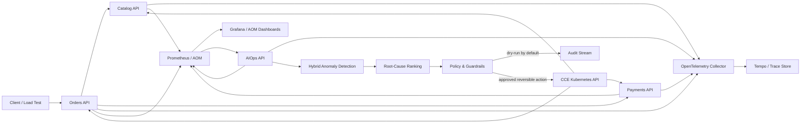

# Architecture

## System context

The project is a deployment-ready reference architecture for operating
cloud-native workloads on Huawei Cloud CCE. It intentionally separates the
business workload, telemetry plane, intelligence plane, and controlled response
plane.

## Runtime components

| Component | Responsibility | Port |
|---|---|---:|
| Catalog API | Product lookup and inventory reservation workload | 8001 |
| Orders API | Idempotent order orchestration and dependency retries | 8002 |
| Payments API | Deterministic payment workload and business metrics | 8003 |
| AIOps API | Detection, diagnosis, incident lifecycle, response decisions | 8004 |
| OpenTelemetry Collector | Trace and metric ingestion and enrichment | 4317/4318 |
| Prometheus | Metric storage, recording rules, and SLO alerts | 9090 |
| Tempo | Distributed trace storage | 3200 |
| Grafana | Executive, SLO, and incident dashboards | 3000 |

## Intelligence flow

1. Services expose RED metrics and emit OpenTelemetry traces.
2. The detector evaluates the latest point against a historical window using
   robust median deviation and Isolation Forest.
3. Material anomalies become correlated signals.
4. The root-cause engine ranks hypotheses from multi-signal evidence.
5. Policy evaluates confidence, risk, mode, target allow-list, and cooldown.
6. Approved active actions are limited to scale-out or runtime containment.
7. High-risk rollback remains a human-approved operation.

## Huawei Cloud mapping

| Reference component | Huawei Cloud target |
|---|---|
| Kubernetes runtime | Cloud Container Engine (CCE) |
| Container registry | Software Repository for Container (SWR) |
| Unified operations | Application Operations Management (AOM 2.0) |
| Logs | Log Tank Service (LTS) |
| Retained exports | Object Storage Service (OBS) |
| Cloud metrics | Cloud Eye |
| Notification integration | Simple Message Notification (SMN) |

See [Huawei Cloud deployment](huawei-cloud-deployment.md) for the boundary
between repository validation and an account-level deployment.
