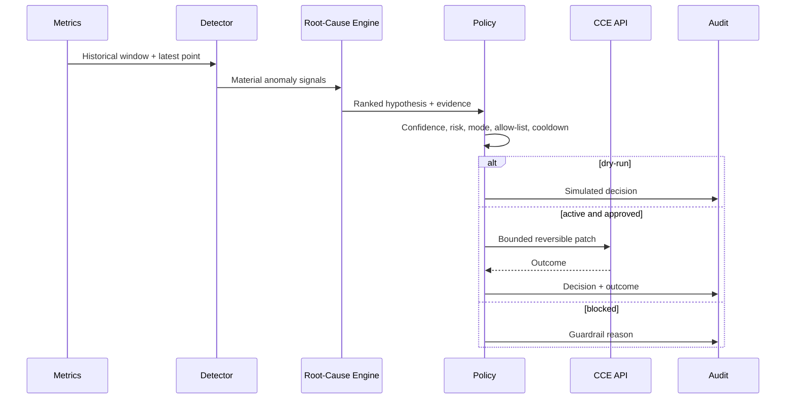

# Incident Automation and Guardrails

## Modes

| Mode | Behavior |
|---|---|
| `disabled` | Diagnose and record; never approve an action |
| `dry-run` | Evaluate policy and simulate the approved action |
| `active` | Execute only allow-listed low/medium-risk actions |

`dry-run` is the default in Docker, Kubernetes, Helm, and documentation.
Any unrecognized mode fails closed at the policy boundary and cannot reach the
automation executor.

## Control sequence

## Active actions

- add one replica, hard limit 12;
- enable catalog circuit-breaker flag on Orders API;
- enable payment degraded-mode flag on Orders API.

Rollback is intentionally blocked because it can create compatibility or data
integrity risk. The RBAC role cannot read secrets, delete workloads, modify
cluster-scoped resources, or access other namespaces.

## Activation checklist

- [ ] Dry-run precision reviewed against incident history.
- [ ] Runbook owner and on-call route assigned.
- [ ] CCE namespace and deployment names verified.
- [ ] Maximum replicas and quota reviewed.
- [ ] Audit retention and access configured.
- [ ] Rollback for each runtime flag tested.
- [ ] Security and change approval completed.
